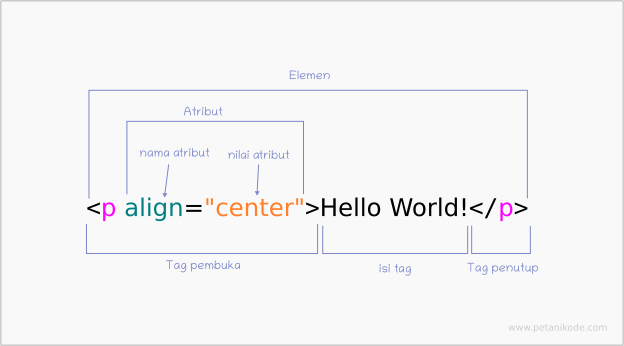

#### Daftar Isi

1. [Tag meta](#tag-meta)


### Tag meta

```cs
<meta charset="UTF-8"> 
```

Dalam dokumen HTML, kita mengindikasikan bahwa dokumen tersebut dienkripsi menggunakan UTF-8, yang berarti semua karakter yang digunakan dalam dokumen tersebut akan direpresentasikan menggunakan skema UTF-8. Ini memastikan bahwa dokumen dapat menampilkan karakter dari berbagai bahasa dan simbol dengan benar.

#### Jika tidak menggunakan? 

Tanpa menggunakan UTF-8, dokumen HTML masih bisa menggunakan encoding karakter lain seperti ASCII, ISO-8859-1 (Latin-1), dan lainnya. Namun, ada beberapa perbedaan dan konsekuensi yang perlu dipertimbangkan:

- Keterbatasan Karakter
- Kesesuaian Multibahasa
- Kompabilitas dengan Perangkat Lunak Modern
- Ukuran File

Sehingga, dengan menggunakan UTF-8 dalam dokumen HTML memberikan fleksibilitas yang lebih besar dalam hal representasi karakter, kompatibilitas dengan perangkat lunak modern, dan efisiensi penyimpanan dan pengiriman data.


```cs
<meta name="description" content="Ini adalah deskripsi singkat tentang halaman web ini.">
```

Pada contoh di atas, ```<meta name="description" content="...">``` digunakan untuk menentukan deskripsi singkat tentang halaman web tersebut. Isi dari deskripsi tersebut disediakan dalam atribut content.

###

### Elemen 

Elemen dalam HTML adalah sebuah komponen yang menyusun dokumen HTML.

